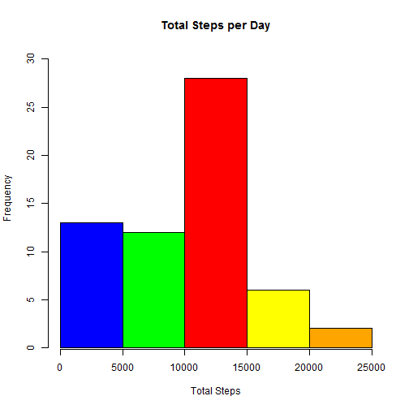
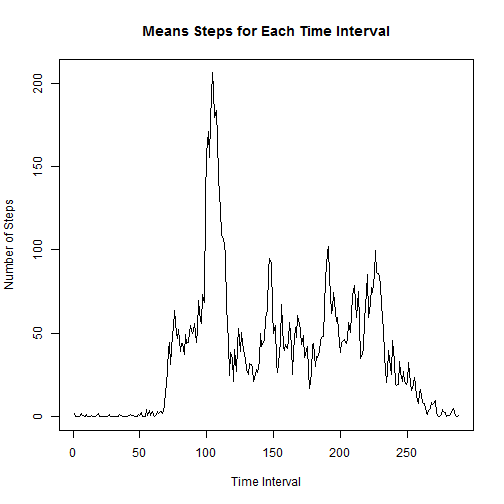
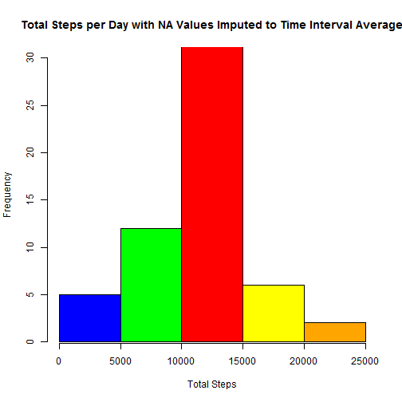
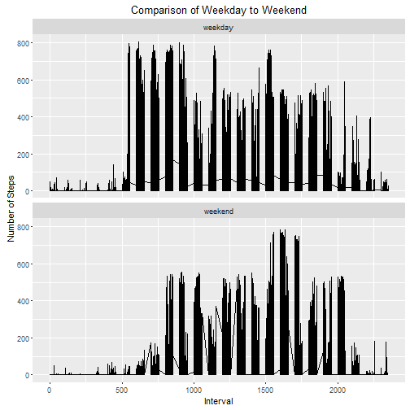

** This document assumes that you have the activity.csv data
in your working directory**


1.Code for reading in the dataset and/or processing the data
Read in the dataset, and convert date to Date object:


```r
data <- read.csv("activity.csv", na.strings = "NA")
```

```
## Warning in file(file, "rt"): cannot open file 'activity.csv': No such file
## or directory
```

```
## Error in file(file, "rt"): cannot open the connection
```

```r
data$date <- as.Date(as.character(data$date))
```

2.Histogram of the total number of steps taken each day
Get the total steps for each date in the data and plot:


```r
library(dplyr)
```

```
## 
## Attaching package: 'dplyr'
```

```
## The following objects are masked from 'package:stats':
## 
##     filter, lag
```

```
## The following objects are masked from 'package:base':
## 
##     intersect, setdiff, setequal, union
```

```r
total_steps_per_day <- summarise(group_by(data, date), sum(steps, na.rm = TRUE))
names(total_steps_per_day) <- c("date", "total_steps")

hist(total_steps_per_day$total_steps, xlab = "Total Steps", main = "Total Steps per Day", col = c("blue", "green", "red", "yellow", "orange"), ylim = c(1,30))
```



3.Mean and median number of steps taken each day

```r
mean(total_steps_per_day$total_steps)
```

```
## [1] 9354.23
```

```r
median(total_steps_per_day$total_steps)
```

```
## [1] 10395
```

4.Time series plot of the average number of steps taken
Divide step averages by the time interval and plot:


```r
mean_steps_per_interval <- tapply(data$steps, data$interval, mean, na.rm=TRUE)

plot(mean_steps_per_interval, type="l", main="Means Steps for Each Time Interval", ylab="Number of Steps", xlab = "Time Interval")
```



5.The 5-minute interval that, on average, contains the maximum number of steps

Redo my average steps per time interval so it is easier to work with
and find the max.

```r
mean_steps_per_interval <- aggregate(steps ~ interval, data, mean)
max_row <- which.max(mean_steps_per_interval$steps)
max_interval <- mean_steps_per_interval[max_row,]
```

6.Code to describe and show a strategy for imputing missing data

Find total number of missing values:

```r
bad <- data[is.na(data),]
num_bad <- nrow(bad)
percent_bad <- num_bad/nrow(data)
```

Replace missing values in their time interval with the mean steps
for that time interval

```r
data_with_impute <- data
for ( i in 1:nrow(data_with_impute)) {
  if ( is.na(data_with_impute$steps[i])){
    interval <- data_with_impute$interval[i]
    row_id <- which(mean_steps_per_interval$interval==interval)
    impute_val <- mean_steps_per_interval$steps[row_id]
    data_with_impute$steps[i] <- impute_val
  }
}
##verify
sum(is.na(data_with_impute$steps))
```

```
## [1] 0
```

```r
sum(is.na(data$steps))
```

```
## [1] 2304
```

7.Histogram of the total number of steps taken each day after missing values are imputed

Redo the analysis above with imputed data:


```r
daily_totals_imputed <- summarise(group_by(data_with_impute, date), sum(steps, na.rm = TRUE))
names(daily_totals_imputed) <- c("date", "total_steps")

hist(daily_totals_imputed$total_steps, xlab = "Total Steps", main = "Total Steps per Day with NA Values Imputed to Time Interval Average", col = c("blue", "green", "red", "yellow", "orange"), ylim = c(1,30))
```



```r
mean(daily_totals_imputed$total_steps)
```

```
## [1] 10766.19
```

```r
median(daily_totals_imputed$total_steps)
```

```
## [1] 10766.19
```

8.Panel plot comparing the average number of steps taken per 5-minute interval across weekdays and weekends

Add a column for day of the week, and for weekend or not:

```r
data_with_impute$day <- weekdays(data_with_impute$date)
##data_with_impute$day <- as.factor(data_with_impute$day)
for ( i in 1:nrow(data_with_impute) ) {
  if ( data_with_impute$day[i] == "Saturday" || data_with_impute$day[i] == "Sunday" ) { data_with_impute$weekend[i] <- "weekend" } else { data_with_impute$weekend[i] <- "weekday" }
}
##factorize
data_with_impute$weekend <- as.factor(data_with_impute$weekend)
```

Make the panel plot: 


```r
library(ggplot2)
qplot(interval, steps, data=data_with_impute, geom=c("line"),
  xlab="Interval", ylab="Number of Steps", main="Comparison of Weekday to Weekend") + facet_wrap(~ weekend, ncol=1)
```



Output markdown files:


```r
library(knitr)
rmarkdown::render("PA1_template.Rmd")
```

```
## 
## 
## processing file: PA1_template.Rmd
```

```
## Error in parse_block(g[-1], g[1], params.src): duplicate label 'setup'
```
